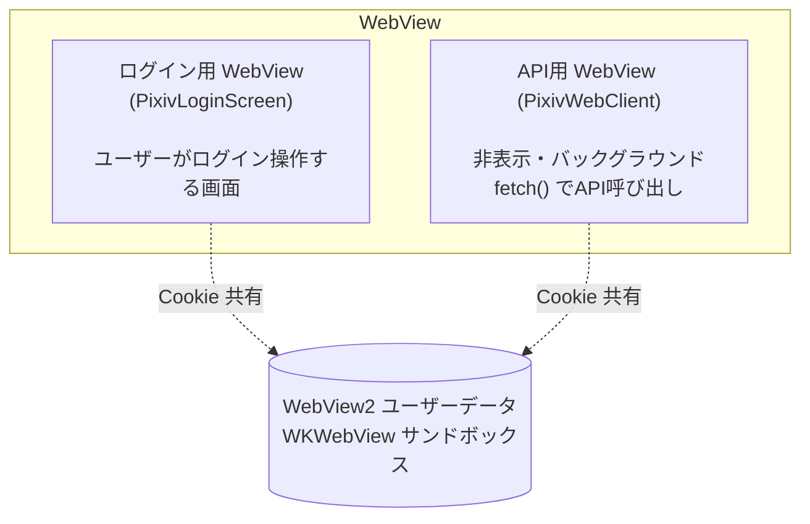

# Pixiv 認証アーキテクチャ

## 概要

Pixiv API は Cookie 認証。WebView でユーザーがログインし、その Cookie を使って API を呼ぶ。

## WebView 構成



- ログイン用と API 用は別の WebView だが、Cookie ストアを共有
- Windows: 両方 `webview_windows`（WebView2）。同一ユーザーデータフォルダで Cookie 共有
- iOS: 両方 `webview_flutter`（WKWebView）。同一 WKWebsiteDataStore で Cookie 共有
- **重要**: `webview_flutter` は Windows 非対応。Windows は必ず `webview_windows`

### なぜ WebView が2つ必要か

- ログイン用: ユーザーが操作する画面。`accounts.pixiv.net/login` を表示
- API 用: 非表示。`pixiv.net` をロードして `fetch()` で API を呼ぶ
- 1つの WebView で両方やると、ログインページの表示と API 呼び出しが干渉する

## 設計原則（プラットフォーム共通）

### 1. 固定遅延（`Future.delayed`）を使わない

ページロードや認証完了の待機に `Future.delayed(3秒)` のような固定遅延を使ってはならない。
ネットワーク速度やサーバー応答時間はプラットフォームや環境で大きく異なり、
短すぎればタイムアウト、長すぎれば無駄な待ち時間になる。

**必ずイベントで完了を検出する:**

| プラットフォーム | WebView パッケージ | ページロード完了の検出 |
|---|---|---|
| Windows | `webview_windows` | `controller.loadingState` ストリームで `LoadingState.navigationCompleted` |
| iOS/Android | `webview_flutter` | `NavigationDelegate.onPageFinished` コールバック |

タイムアウト（10秒）はフォールバックとして設定するが、正常系では使われない。

### 2. 処理の完了を確認してから次に進む

各ステップは前のステップの完了を await してから実行する。
fire-and-forget で処理を走らせると、並行実行で状態が壊れる。

例:
- ❌ `loadUrl()` して `Future.delayed(3秒)` → 「多分ロードされただろう」
- ✅ `loadUrl()` して `navigationCompleted` を待つ → 確実にロード完了
- ❌ `onLoginSuccess` 内で `waitForUserId()` をバックグラウンド実行 → API 呼び出しと干渉
- ✅ ログイン画面の `_extractUserIdAsync()` で取得完了後に pop → 確実に userId がある

### 3. 各ステップでログを出力する

WebView の操作はブラックボックスになりやすい。各ステップの開始・完了・失敗を
ログに出力し、問題発生時に原因を特定できるようにする。

### 4. ログイン確認はログイン用 WebView が行う

API 用 WebView で Cookie の有効性を確認しようとすると:
- `about:blank` からの fetch は Cookie が付かない（Origin=null の制約）
- `pixiv.net` をロードすると未ログイン時にリダイレクトされて状態が壊れる

ログイン用 WebView で `accounts.pixiv.net/login` にアクセスすれば、
Cookie 有効時は `www.pixiv.net` に即リダイレクトされるので、これで判定する。

### 5. API 用 WebView のページロードはログイン確認後に1回だけ

ログイン前にロードすると、未ログインの場合にリダイレクトされて
API WebView の状態が不正になる。必ずログイン確認後に行う。

## 認証フロー

### 統一フロー（Cookie 有効/無効で分岐しない）

```
ユーザーが Pixiv タップ
  → registry.resolve("pixiv:default")
    → SourceRegistry._resolvePixiv(context)
      → _pixivLoginVerified? → Yes: new PixivSource を返す（2回目以降）
      → No: onPixivLoginRequired(context)
        → _handlePixivLogin(context)  [app.dart]
          → await _webClient.initialize()
            → API WebView コントローラー作成のみ（ページロードしない）
          → ログイン画面を push（accounts.pixiv.net/login をロード）
            → Cookie 有効: pixiv が www.pixiv.net に即リダイレクト
            → Cookie 無効: ユーザーがログイン → www.pixiv.net 到達
          → userId + CSRF トークン抽出（onPageFinished 後）
          → await _webClient.loadPixivPage()
            → API WebView で pixiv.net をロード（Cookie は共有済み）
            → ページロード完了を検出
          → pop(true)
          → return PixivApiClient ✓
```

### 設計上の重要な決定事項

1. **ログイン確認はログイン用 WebView が担う**。API 用 WebView は認証に関わらない。
   `accounts.pixiv.net/login` にアクセスすると、Cookie が有効なら `www.pixiv.net` に
   即リダイレクトされる。これをログイン確認に利用する。

2. **API 用 WebView のページロードはログイン確認後に1回だけ**。
   ログイン前にロードすると、未ログインの場合 pixiv がリダイレクトして
   API WebView の状態がおかしくなる。

3. **about:blank からの fetch は Cookie が付かない**（Origin=null）。
   API WebView でのログイン状態の事前確認はできない。

4. **Cookie 有効時のログイン画面表示**: ログイン画面は Cookie 有効時に即リダイレクトで
   pop されるが、その間「Pixiv に接続中...」のローディング表示を出す。
   ログインが必要な場合のみ WebView を表示する。

## ログイン画面の表示制御

```
accounts.pixiv.net/login をロード
  ↓
_onUrlChanged で URL を監視:
  - accounts.pixiv.net → _showWebView = true（ログインフォーム表示）
  - www.pixiv.net      → _showWebView = false（ローディングに戻す）
                         → onPageFinished 待ち
                         → userId + CSRF 抽出
                         → API WebView ロード
                         → pop(true)
```

- `_showWebView = false` の間は「Pixiv に接続中...」を表示
- `_showWebView = true` になるとログイン WebView を表示
- `www.pixiv.net` 到達で即座に WebView を隠してから pop（pixiv ホームが見えないように）

## ログイン成功の判定

- `accounts.pixiv.net` の別ページ（reCAPTCHA、追加認証）ではまだ完了でない
- `www.pixiv.net` に URL が到達した時点で完了
- ユーザーID は `PixivLoginScreen._extractUserIdAsync()` でログインページの HTML から取得
- pop はログイン画面自身の context で行う（`_AppRoot` の context で pop すると
  HomeScreen が unmount される問題があった）

## API WebView の並行アクセス禁止

`fetchJson` は WebView 上で JavaScript の `fetch()` を実行し、結果を
`window['_pixiv_result_N']` に格納してポーリングで取得する。

同じ WebView で複数の fetchJson が並行して走ると:
- ページ遷移で `window` オブジェクトが消える
- JavaScript 実行が干渉してタイムアウトする

したがって:
- `onLoginSuccess` 内で `waitForUserId` を呼ばない（fetchJson と干渉）
- バックグラウンドで API 呼び出しを同時に走らせない

## ソースの取得経路

すべての Pixiv アクセスは `SourceRegistry.resolve()` を経由する。
直接 `PixivSource()` を new しない。registry がログイン確認のゲートキーパー。

```
HomeScreen._openPixiv()       → registry.resolve("pixiv:default")
FavoritesTab._onItemTap()     → registry.resolve(entry.sourceKey)
ViewerScreen._loadFullImage() → registry.resolve(image.sourceKey)
```

## PixivSource のライフサイクル

- `PixivApiClient`（WebView ラッパー）: アプリに1つ、全画面で共有
- `PixivSource`（API + ページネーション状態）: 画面ごとに新規作成
  - おすすめ一覧用、検索結果用、作者一覧用がそれぞれ独立
  - ファイルディスクリプタのように「読み進め位置」を持つ
- `SourceRegistry._pixivLoginVerified`: ログイン確認済みフラグ。
  true になると以降は `_handlePixivLogin` を呼ばずに即 PixivSource を返す

## 解決済みの課題

