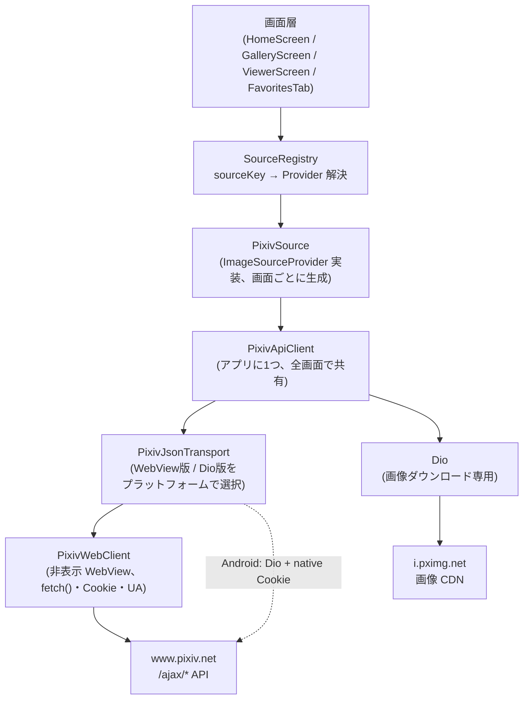

# Pixiv 接続仕様

Pixiv との通信全体 (API 呼び出し・画像ダウンロード・データモデル・画面への提供) の仕様。
認証フロー (ログイン・WebView 2台構成・CSRF トークン取得) は [pixiv_auth.md](pixiv_auth.md) を参照。

## 全体構成



| クラス | ファイル | 役割 |
|---|---|---|
| `PixivWebClient` | `lib/services/pixiv/pixiv_web_client.dart` | 非表示 WebView 上で `fetch()` を実行し JSON を返す。Cookie/UA の供給元 |
| `PixivJsonTransport` | `lib/services/pixiv/pixiv_json_transport.dart` | JSON 取得の抽象化。`WebViewJsonTransport` / `DioJsonTransport` を `forPlatform()` で選択 |
| `PixivApiClient` | `lib/services/pixiv/pixiv_api_client.dart` | Pixiv Web Ajax API のエンドポイント別メソッド + 画像ダウンロード |
| `PixivSource` | `lib/services/sources/pixiv_source.dart` | `ImageSourceProvider` 実装。パス解釈とページネーション状態を持つ |
| `SourceRegistry` | `lib/services/sources/source_registry.dart` | `"pixiv:default"` の解決とログインのゲートキーパー |
| `PixivArtwork` ほか | `lib/models/pixiv_artwork.dart` | API レスポンスのデータモデル |

## 通信経路は 2 系統

### 1. JSON API: WebView の fetch() 経由

Pixiv の Web Ajax API (`/ajax/*`) は httpOnly Cookie によるセッション認証のため、
Dart の HTTP クライアントからは Cookie を送信できない。そこで、ログイン済み Cookie を
持つ非表示 WebView 内で JavaScript の `fetch()` を実行し、結果を取り出す。

#### トランスポート抽象化 (`PixivJsonTransport`)

JSON 取得は `PixivJsonTransport` で抽象化され、プラットフォームで実装を切り替える
(`PixivApiClient` が `forPlatform()` で選択)。

| 実装 | 経路 | 使用プラットフォーム |
|---|---|---|
| `WebViewJsonTransport` | WebView の `fetch()` (下記) | Windows、iOS、フォールバック |
| `DioJsonTransport` | Dio 直接 + native Cookie (後述「1b」) | Android |

WebView の `fetch()` 経路は、大きなレスポンス (例: `top/illust` は 1〜1.5MB) で
**Android だと遅い** (WebView メインスレッド競合 + 100ms ポーリング + 巨大文字列の
JS→Dart ブリッジ転送で 5〜6 秒)。Windows は CPU/回線が速くこの影響が小さい。
そのため Android のみ Dio 直接取得に切り替え、~2 倍高速化している
(設計判断の詳細はメモ `project_pixiv_dio_transport` を参照)。POST (ブックマーク) は
頻度が低く性能要件もないため、全プラットフォームで WebView 経路に委譲する。

#### fetch 実行の仕組み (`PixivWebClient`)

1. `fetch()` を発行する JS を `executeScript` で注入。結果は `window['_pixiv_result_N']`
   (N はリクエストごとの連番) に文字列で格納される
2. Dart 側は 100ms 間隔で最大 100 回 (= 10 秒) `window['_pixiv_result_N']` をポーリング
3. 値が入ったら `delete window['_pixiv_result_N']` で消去し、JSON をデコードして返す
4. 10 秒で取得できなければ `Exception('Pixiv ... timeout')` を throw

注意点:

- WebView の `evaluateScript` は JSON 文字列をさらに引用符で包んで返すため、
  外側の引用符を `jsonDecode` で剥がしてから本体を `jsonDecode` する 2 段デコードを行う
- **同一 WebView での並行 fetch は禁止** (詳細は [pixiv_auth.md](pixiv_auth.md) の
  「API WebView の並行アクセス禁止」)
- 呼び出し前に `loadPixivPage()` で `www.pixiv.net` をロード済みであること
  (`_isReady`)。未ロードなら例外を throw

#### GET (`fetchJson`)

```
fetch(url, {
  credentials: 'include',
  headers: {
    'Accept': 'application/json',
    'X-Requested-With': 'XMLHttpRequest'
  }
})
```

#### POST (`postJson`)

GET のヘッダに加えて `Content-Type: application/json` と `x-csrf-token` を送る。
CSRF トークンはログイン画面 (`PixivLoginScreen._extractCsrfToken`) が
`www.pixiv.net` のページ HTML から抽出して `PixivWebClient.csrfToken` に設定する。
トークン未設定で `postJson` を呼ぶと例外を throw。

### 1b. JSON API (Android): Dio 直接 + native Cookie

Android では GET を `DioJsonTransport` が直接 HTTP で取得する。WebView の
オーバーヘッド (ポーリング・ブリッジ転送・SPA スレッド競合) を回避でき、
残るのは純粋なネットワーク転送時間だけになる。

仕組み:

1. **Cookie**: `PixivWebClient.getNativeCookie(url)` が MethodChannel `pixiv/cookies`
   (`MainActivity.kt`) 経由で Android の `CookieManager.getCookie()` を呼ぶ。
   これは `document.cookie` (JS) では見えない **httpOnly Cookie (`PHPSESSID` 等) も返す**。
   `__cf_bm` 等は更新されるため **リクエストごとに最新を読む**
2. **User-Agent**: `loadPixivPage()` 完了時に WebView の `navigator.userAgent` を取得して
   `PixivWebClient.userAgent` に保持し、Dio で流用する。Cloudflare の `__cf_bm` は
   Cookie を取得した UA に紐づくため、**UA を一致させないとチャレンジで弾かれる**
3. ヘッダ: 上記 `Cookie` + `User-Agent` に加え `Referer`, `X-Requested-With`,
   `Accept: application/json`
4. レスポンスが JSON でない (Cloudflare チャレンジ等) 場合は `FormatException` を
   検知し、先頭 200 文字を warning ログに出して例外を throw

> iOS も遅いが、`WKHTTPCookieStore` からの httpOnly Cookie 取り出しは未検証のため
> 現状は WebView 経路。検証できれば同様に Dio 化できる。

### 2. 画像ダウンロード: Dio 直接

画像 CDN (`i.pximg.net`) は Cookie 不要だが **Referer チェックがある**。
`PixivApiClient` 内の専用 Dio インスタンスが以下のヘッダで直接 GET する。

| ヘッダ | 値 |
|---|---|
| `Referer` | `https://www.pixiv.net/` (これがないと 403) |
| `User-Agent` | Chrome 相当の UA 文字列 |

`downloadImage(url, onProgress)` は `Uint8List` を返す。進捗コールバックは
ビューアのダウンロード表示に使われる。

## API エンドポイント一覧 (`PixivApiClient`)

ベース URL: `https://www.pixiv.net`

| メソッド | HTTP | エンドポイント | 内容 |
|---|---|---|---|
| `illustDetail(id)` | GET | `/ajax/illust/{id}` | 作品詳細 → `PixivArtwork` |
| `illustPages(id)` | GET | `/ajax/illust/{id}/pages` | 全ページの画像 URL → `List<PixivPage>` |
| `illustTop()` | GET | `/ajax/top/illust?mode=all&lang=ja` | トップページのおすすめ |
| `userBookmarksIllust(userId)` | GET | `/ajax/user/{userId}/illusts/bookmarks?tag=&offset={o}&limit={l}&rest={show\|hide}&lang=ja` | ブックマーク一覧 |
| `searchIllust(word)` | GET | `/ajax/search/artworks/{word}?word={word}&order={sort}&s_mode=s_tag_full&p={page}&type=all&lang=ja` | タグ完全一致検索 |
| `userIllusts(userId)` | GET ×2 | `/ajax/user/{userId}/profile/all` → `/ajax/user/{userId}/profile/illusts?ids[]=...` | ユーザーの作品一覧 (下記参照) |
| `bookmarkAdd(id, restrict)` | POST | `/ajax/illusts/bookmarks/add` | ブックマーク追加。`restrict`: 0 = 公開、1 = 非公開 |

共通エラー処理: レスポンスの `error == true` なら `message` を添えて
`Exception('Pixiv API error: ...')` を throw する (`_checkError`)。

### エンドポイント別の注意点

- **`illustTop()`**: レスポンス body をインスタンス内にキャッシュし複数タブで共有する。
  リロード時は `clearTopCache()` を呼ぶ。`requests` (有償リクエスト宣伝、
  `postWork.postWorkId`) に該当する作品 ID は結果から除外する
- **`searchIllust()`**: 結果の `illustManga.data` には広告コンテナ
  (`{isAdContainer: true}`) が混ざるため、`id` を持たない要素を除外する
- **`userIllusts()`**: 2 段階で取得する
  1. `/profile/all` で全作品 ID を取得。`illusts` / `manga` は作品がある場合は Map、
     ない場合は空 List で返るため型を確認して処理する。ID を統合・重複除去し
     新しい順 (ID 降順) にソート
  2. ID を offset から最大 30 件切り出し、`/profile/illusts?ids[]=...` で詳細を一括取得

## ページネーション

一覧系 API は `PixivIllustList { illusts, nextOffset }` を返す。
`nextOffset` の意味はエンドポイントによって異なる点に注意。

| API | nextOffset の意味 | 計算 |
|---|---|---|
| `userBookmarksIllust` | 次の offset (件数) | `offset + limit < total` なら `offset + limit`、それ以外 null |
| `searchIllust` | 次のページ番号 (1 始まり) | まだ総数に達していなければ `page + 1` |
| `userIllusts` | 次の offset (件数) | `offset + effectiveLimit < 全 ID 数` なら次 offset |
| `illustTop` | 常に null (ページネーションなし) | — |

`PixivSource` が `_nextOffset` として保持し、次回 `listImages()` 呼び出し時に
そのまま該当 API に渡す。`null` なら最終ページ (`hasNextPage == false`)。
リロード時は `resetPagination()` で先頭に戻す。

## PixivSource (ImageSourceProvider 実装)

### パス仕様 (`listImages(path)`)

| path | 動作 |
|---|---|
| `null` または `/top` | おすすめ一覧 (`illustTop`) |
| `/bookmarks` | 自分のブックマーク (`userBookmarksIllust`)。`userId` 未取得なら例外 |
| `/user/{userId}` | 指定ユーザーの作品一覧 (`userIllusts`) |
| `/search?word={word}` | タグ検索 (`searchIllust`)。word が空なら例外 |

画面側では Pixiv の URL (例: `https://www.pixiv.net/users/12345`) をパスに変換して
渡す (`gallery_screen.dart` の変換処理を参照)。

### ImageSource への変換

一覧の各作品は `ImageSource` に変換される。

- `id`: 作品 ID (複数ページ展開後は `{illustId}_p{i}`)
- `type`: `ImageSourceType.pixiv`、`sourceKey`: `"pixiv:default"`
- `metadata`: `illustId`, `thumbnailUrl`, `author`, `authorId`, `tags`, `pageCount`,
  `width`, `height`, `bookmarks`, `views`
  (ページ展開後はさらに `pageIndex`, `regularUrl`, `originalUrl`)

### 画像取得の解像度選択

- `fetchThumbnail()`: `metadata['thumbnailUrl']` (一覧 API の `url`、250x250 相当)
- `resolvePages()`: ビューアで作品を開くときに `illustPages()` を呼び、
  ページごとの高解像度 URL (`regular` / `original`) を metadata に展開する
- `fetchFullImage()`: `regularUrl` (中サイズ) を優先、なければ `originalUrl`、
  最後に `uri` へフォールバック

## ライフサイクルと取得経路

- すべての Pixiv アクセスは `SourceRegistry.resolve("pixiv:default", context)` を
  経由する。直接 `PixivSource()` を new しない
- 初回 resolve 時はログインフロー ([pixiv_auth.md](pixiv_auth.md)) が走る。
  並行 resolve は `_pixivResolveFuture` で直列化され、ログイン画面の二重表示を防ぐ。
  ログイン確認済み (`_pixivLoginVerified`) 以降は即座に新しい `PixivSource` を返す
- `PixivWebClient` / `PixivApiClient` はアプリに 1 つ (`app.dart` の `_AppRoot` が保持)
- `PixivSource` は resolve のたびに新規生成され、画面ごとに独立した
  ページネーション状態を持つ (ファイルディスクリプタのような扱い)。
  `PixivSource.dispose()` は何もしない (共有クライアントを閉じない)

## 制約・既知の注意点

- **API は非公式**。Pixiv の Web フロントエンドが使う内部 Ajax API のため、
  レスポンス構造が予告なく変わる可能性がある。パース時は null 許容で防御している
- **fetch の並行実行禁止**: 同一 WebView 上で複数の `fetchJson` を同時に走らせない
- **レートリミット対策はなし**: アプリ側でのリクエスト間隔制御は未実装
- **画像 URL の有効性**: `i.pximg.net` の URL は Referer さえあれば認証不要なので、
  お気に入り (URL のみ保存) からの再取得が成立する
